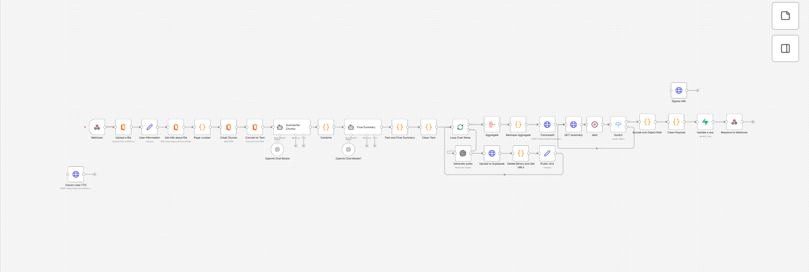

# Audiobook generation pipeline

*n8n · OpenAI · TTS · Transloadit · Supabase*

Turns an uploaded PDF into a narrated audio summary: map-reduce summarisation, per-segment speech synthesis, then async concatenation into a single track.

| File | What it is |
|---|---|
| `workflow.json` | Sanitised export — import into n8n |
| `canvas.png` | The graph as built |

Every host, credential, id and webhook URL in the export is a placeholder. See
[SANITISING.md](../SANITISING.md) for what was replaced and why.

The full write-up, including the design rationale, is in the
[root README](../README.md#audiobook-generation-pipeline).
