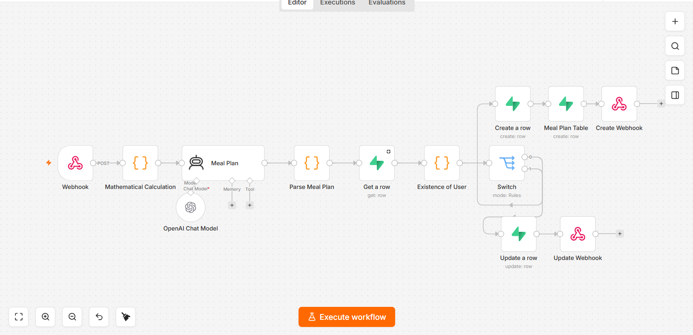

# Meal plan onboarding

*n8n · gpt-5.1 agent with memory and tools · Supabase*

Builds a personalised meal plan at onboarding. BMR, TDEE and the macro split are computed in code first; the agent composes meals against numbers it is given rather than numbers it invents.

| File | What it is |
|---|---|
| `workflow.json` | Sanitised export — import into n8n |
| `canvas.png` | The graph as built |

Every credential, account id, webhook path and resource id in the export is a placeholder. See
[SANITISING.md](../SANITISING.md) for what was replaced and why.

Full write-up with the design rationale is in the [root README](../README.md#02--meal-plan-onboarding).
