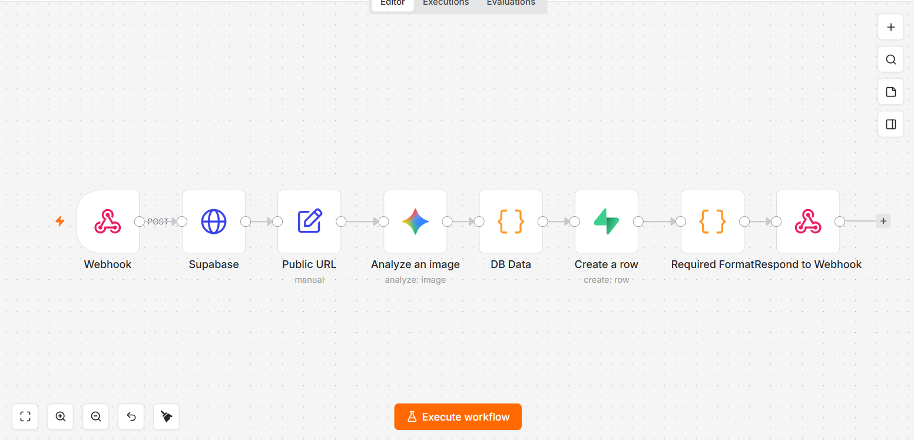

# Meal photo analysis

*n8n · Google Gemini 2.5 Pro · Supabase*

Identifies a meal from a photo and itemises calories and macros, constrained to raw JSON so the mobile client is only ever handed a parsed row.

| File | What it is |
|---|---|
| `workflow.json` | Sanitised export — import into n8n |
| `canvas.png` | The graph as built |

Every credential, account id, webhook path and resource id in the export is a placeholder. See
[SANITISING.md](../SANITISING.md) for what was replaced and why.

Full write-up with the design rationale is in the [root README](../README.md#03--meal-photo-analysis).
