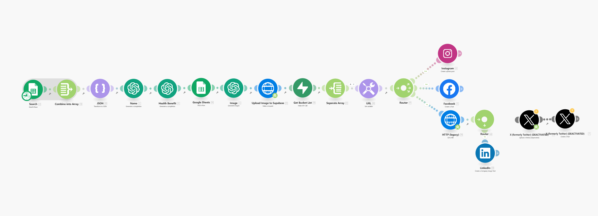

# Multi-channel social publishing

*Make · gpt-4o · DALL·E 3 · Google Sheets · Supabase Storage*

Turns a spreadsheet backlog into finished posts across Instagram, Facebook, LinkedIn and X, with a per-destination router and assets persisted before publish so a failure retries rather than regenerates.

| File | What it is |
|---|---|
| `workflow.json` | Sanitised export — import into Make |
| `canvas.png` | The graph as built |

Every credential, account id, webhook path and resource id in the export is a placeholder. See
[SANITISING.md](../SANITISING.md) for what was replaced and why.

Full write-up with the design rationale is in the [root README](../README.md#04--multi-channel-social-publishing).
