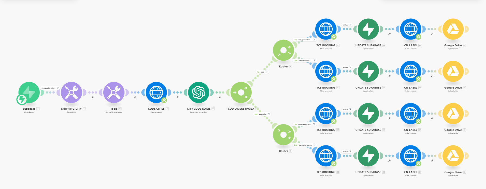

# E-commerce shipping

*Make · gpt-4o · TCS courier API · Supabase · Google Drive*

Running in production for my own business. Books couriers on new orders, using a model to normalise free-text cities into courier codes, then branching on payment method and order value.

| File | What it is |
|---|---|
| `workflow.json` | Sanitised export — import into Make |
| `canvas.png` | The graph as built |

Every credential, account id, webhook path and resource id in the export is a placeholder. See
[SANITISING.md](../SANITISING.md) for what was replaced and why.

Full write-up with the design rationale is in the [root README](../README.md#05--e-commerce-shipping).
