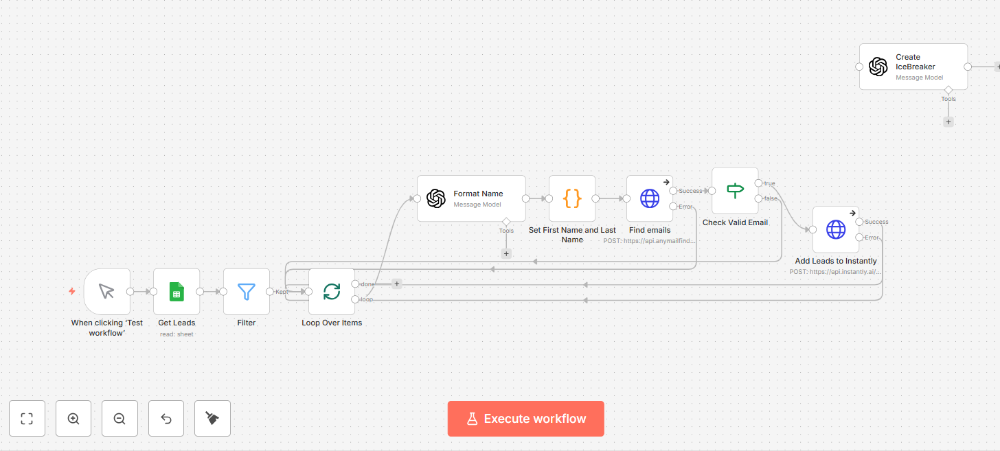

# Lead generation and outreach

*n8n · LLM agents · AnyMailFinder · Instantly*

Sources and enriches prospects, verifies every address before it enters a campaign, and writes a personalised icebreaker per lead.

| File | What it is |
|---|---|
| `workflow.json` | Sanitised export — import into n8n |
| `canvas.png` | The graph as built |

Every credential, account id, webhook path and resource id in the export is a placeholder. See
[SANITISING.md](../SANITISING.md) for what was replaced and why.

Full write-up with the design rationale is in the [root README](../README.md#06--lead-generation-and-outreach).
