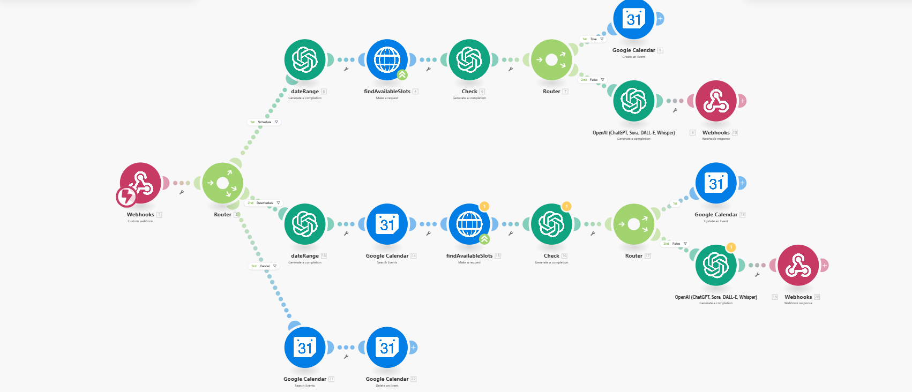

# Voice appointment agent

*Make · gpt-4o · Cal.com · Google Calendar · VAPI*

Takes appointment calls for a dental clinic. VAPI handles speech; the model parses intent and language while Cal.com and Google Calendar remain the source of truth for what is actually free.

| File | What it is |
|---|---|
| `workflow.json` | Sanitised export — import into Make |
| `canvas.png` | The graph as built |

Every credential, account id, webhook path and resource id in the export is a placeholder. See
[SANITISING.md](../SANITISING.md) for what was replaced and why.

Full write-up with the design rationale is in the [root README](../README.md#07--voice-appointment-agent).
