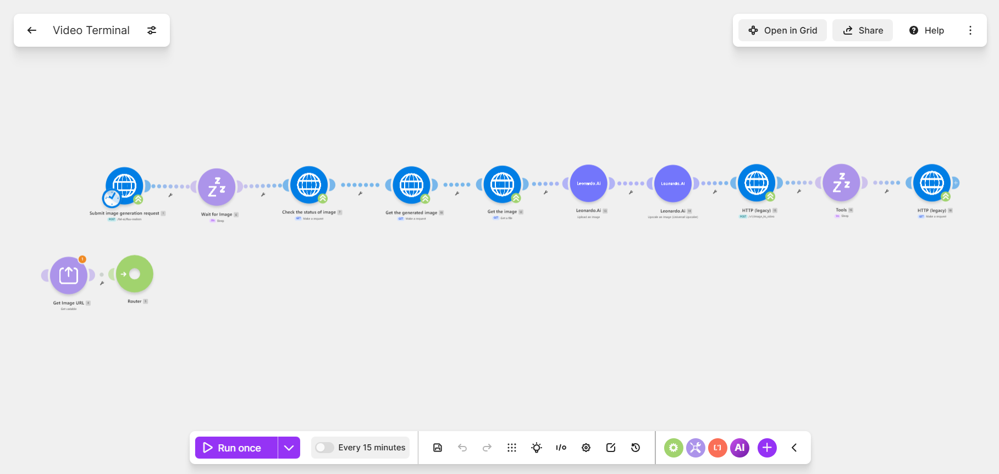

# Video generation

*Make · fal.ai FLUX · Leonardo.AI · RunwayML Gen-3*

Text prompt to finished video clip across three vendors: fal.ai generates the still, Leonardo.AI upscales it, RunwayML animates it. Each vendor runs its own async job queue, so the scenario submits and polls three separate times rather than blocking.

| File | What it is |
|---|---|
| `workflow.json` | Sanitised export — import into Make |
| `canvas.png` | The graph as built |

Every credential, account id, webhook path and resource id in the export is a placeholder. See
[SANITISING.md](../SANITISING.md) for what was replaced and why.

Full write-up with the design rationale is in the [root README](../README.md#08--video-generation).
