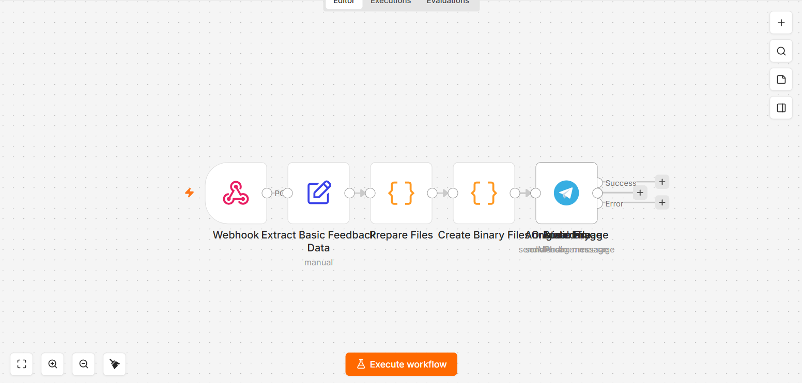

# Video review feedback

*n8n · webhook · base64 media handling*

A reviewer pauses a video, draws on the frame, records a voice note and types a comment. The webhook receives all of it as one package and turns it into delivered attachments, with each media type optional.

| File | What it is |
|---|---|
| `workflow.json` | Sanitised export — import into n8n |
| `canvas.png` | The graph as built |

Every credential, account id, webhook path and resource id in the export is a placeholder. See
[SANITISING.md](../SANITISING.md) for what was replaced and why.

Full write-up with the design rationale is in the [root README](../README.md#09--video-review-feedback).
