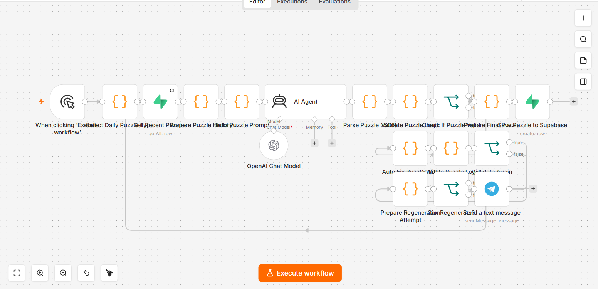

# Daily puzzle generation

*n8n · OpenAI agent · Supabase*

Generates one solvable puzzle per day. The interesting part is not generation but what happens when the model gets it wrong: validate, auto-repair in code, re-validate, then a bounded regeneration attempt before giving up and alerting.

| File | What it is |
|---|---|
| `workflow.json` | Sanitised export — import into n8n |
| `canvas.png` | The graph as built |

Every credential, account id, webhook path and resource id in the export is a placeholder. See
[SANITISING.md](../SANITISING.md) for what was replaced and why.

Full write-up with the design rationale is in the [root README](../README.md#10--daily-puzzle-generation).
