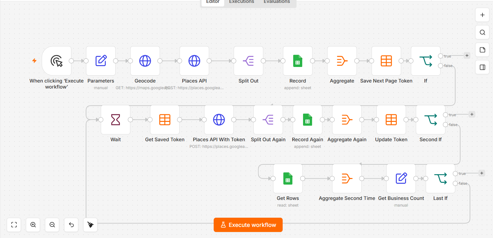

# Maps lead scraper

*n8n · Google Geocoding + Places · Google Sheets · n8n data table*

Finds businesses by category and location and writes them to a sheet. Pagination is the whole problem: the Places cursor is persisted to a data table so the loop survives across executions rather than living in memory.

| File | What it is |
|---|---|
| `workflow.json` | Sanitised export — import into n8n |
| `canvas.png` | The graph as built |

Every credential, account id, webhook path and resource id in the export is a placeholder. See
[SANITISING.md](../SANITISING.md) for what was replaced and why.

Full write-up with the design rationale is in the [root README](../README.md#11--maps-lead-scraper).
