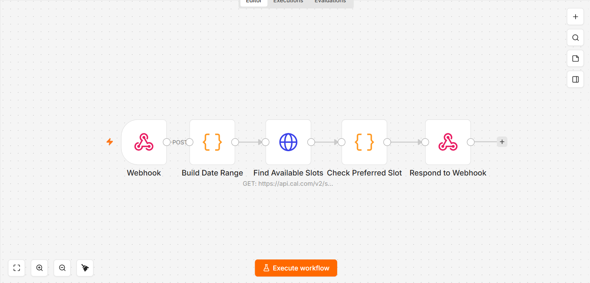

# Pest control booking voice agent

*n8n · VAPI · Cal.com · Google Calendar · Gmail*

An inbound voice agent that handles the whole booking lifecycle for a pest control company: check what is free, book it, look up an existing appointment, then reschedule or cancel it. VAPI handles speech and calls out to four separate n8n webhooks, one per tool the agent can use.

Built for a client. The name is withheld, and this is the development export, so the calendar and email values point at my own test accounts rather than the client's live ones.

| Workflow | Voice tool | What it does |
|---|---|---|
| `01-check-availability` | `check_availability` | Parses a spoken day and time, asks Cal.com for real slots, answers whether the caller's preferred time is actually free |
| `02-book-appointment` | booking | Writes the appointment to Google Calendar and sends a confirmation email |
| `03-look-up-booking` | lookup | Finds a caller's existing appointment by matching against calendar events |
| `04-reschedule-or-cancel` | reschedule / cancel | One webhook, switch-routed: cancel deletes the event and emails, reschedule updates it and emails |

## Why it is built this way

**One webhook per tool, not one endpoint with a mode flag.** A voice agent's tool list is the contract. Keeping the mapping one to one means a tool can be changed, tested or disabled without touching the others, and a failure is isolated to the tool that caused it.

**Time parsing happens in code, not in the prompt.** `Build Date Range` resolves "today", "tomorrow" and weekday names against a caller-supplied datetime context, in `Asia/Qatar`, before anything reaches Cal.com. Models are unreliable at date arithmetic and a wrong date books a real van to a real address.

**Availability is answered by exact timestamp comparison.** `Check Preferred Slot` flattens Cal.com's date-grouped response and compares epoch milliseconds rather than formatted strings, so timezone rendering cannot make a busy slot look free.

**Responses are shaped for VAPI's tool-call protocol.** Each workflow reads `toolCalls[0]`, carries the `toolCallId` through, and returns it with the result, which is what lets the agent keep talking while the lookup happens.

## Known limitation

Cal.com owns availability and Google Calendar owns the bookings, so there are two sources of truth. An appointment created directly in Google Calendar does not remove the slot from Cal.com. It holds because bookings only ever arrive through this agent, but a second booking channel would need Cal.com to become the only writer, with Google Calendar demoted to a mirror.

| File | What it is |
|---|---|
| `0*.json` | Sanitised exports, import into n8n |
| `0*-canvas.png` | Each graph as built |

Every credential, webhook path, calendar id and email address in these exports is a placeholder, and the client's business name has been genericised. See [SANITISING.md](../SANITISING.md) for what was replaced and why.
