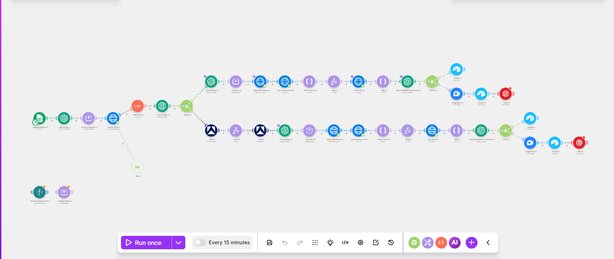

# Outbound AI caller

*Make · VAPI · gpt-4o · Deepgram · Apify · Airtable · Twilio · Google Meet*

Works a list of business leads by phone. For each lead it researches the business, rewrites the voice agent's script for that specific business, places the call, then reads the transcript and books a meeting if the prospect said yes.

Pairs with [`11-maps-lead-scraper`](../11-maps-lead-scraper), which builds the lead list this scenario consumes.

Built for a client. The name is withheld, and this is the development export, so the dial target and account ids point at my own test values rather than the client's live ones.

## The pipeline

1. **Read a lead** from a Google Sheet.
2. **Clean the business name.** Scraped listing titles arrive full of locations, services and promotional text, so a model extracts just the name.
3. **Research the business.** Fetch its website, strip the HTML to text, then have a model pull the social profile URLs out as strict JSON.
4. **Branch on what was found.** If a LinkedIn URL exists, an Apify actor scrapes it for a deeper profile. If not, the website text alone is used. Enrichment cost is only paid where there is something to enrich.
5. **Write the script for this lead.** A model produces a specific compliment, capped at fifteen words, plus the pitch.
6. **Rewrite the agent, then dial.** `PATCH /assistant` pushes the new `firstMessage` and system prompt into VAPI, then `POST /call` places the call.
7. **Wait, then collect.** Sleep, then poll the call for its transcript.
8. **Classify the outcome.** A model reads the transcript and returns `SCHEDULED` with a date and time, or `NOTBOOKED`.
9. **Act on it.** `NOTBOOKED` is logged to Airtable. `SCHEDULED` creates a Google Meet, logs to Airtable, and texts the link by Twilio.

## Why it is built this way

**The agent is rewritten per lead, not prompted per lead.** Rather than passing the research in as call variables, the scenario patches the assistant itself before dialling. The opening line is already specific to that business when the prospect picks up, which is the difference between a cold call and one that sounds researched.

**A model decides the outcome, not a keyword match.** "Yeah, Tuesday works" and "sure, send something over" mean different things, and no keyword rule separates them. The classifier returns one of two tokens, and the router branches on that token alone, so the fuzzy judgement is contained in one step and everything downstream is deterministic.

**Deepgram `nova-2-phonecall` is chosen deliberately.** Phone audio is narrowband and lossy, and a transcription model tuned for it holds up where a general one drops names and numbers.

**The loop closes without a human.** A booked call becomes a calendar invite, a CRM row and an SMS with the link, in the same run that produced it.

## Known limitations

Completion is handled with a fixed sleep before polling, so a call that runs longer than expected is read before it finished. A webhook on VAPI's end-of-call event would remove the guess.

There is no retry, no do-not-call list and no per-run call cap. Anyone adapting this for real outreach needs all three, plus consent and calling-hours rules for the jurisdiction being dialled.

| File | What it is |
|---|---|
| `workflow.json` | Sanitised blueprint, import into Make |
| `canvas.png` | The graph as built |

Every credential, resource id, phone number, spreadsheet id and email address in the export is a placeholder. See [SANITISING.md](../SANITISING.md) for what was replaced and why.
